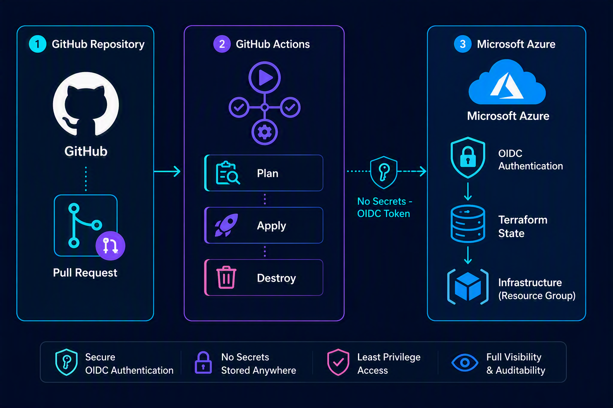

<div align="center">

# Azure Infrastructure Deployment Pipeline
### Terraform · GitHub Actions · OIDC (Zero-Secret Authentication)

[](https://www.terraform.io/)
[](https://azure.microsoft.com/)
[](https://github.com/features/actions)
[](https://learn.microsoft.com/azure/developer/github/connect-from-azure)
[](#license)

**A production-grade Infrastructure-as-Code (IaC) pipeline that provisions Azure resources through Terraform, orchestrated end-to-end by GitHub Actions, and authenticated via OpenID Connect (OIDC) — eliminating the need to store any long-lived credentials.**

</div>

---

## 📐 Architecture Overview

<div align="center">

</div>

This pipeline follows a **GitOps-driven deployment model**: infrastructure changes are proposed via Pull Request, automatically previewed, peer-reviewed, and — upon merge — applied to Azure with zero manual intervention and zero stored credentials.

---

## ✨ Key Highlights

| Capability | Description |
|---|---|
| 🔐 **Zero-Secret Authentication** | Uses Microsoft Entra ID **Workload Identity Federation (OIDC)** — no client secrets, access keys, or passwords are ever stored in GitHub. |
| 🗂️ **Remote State Management** | Terraform state is persisted in an **Azure Storage Account** with blob-lease locking and versioning enabled, preventing state corruption and concurrent-write conflicts. |
| 🔍 **Preview Before Apply** | Every Pull Request triggers an automated `terraform plan`, posted directly as a PR comment for stakeholder review prior to merge. |
| ⚙️ **Automated Apply on Merge** | Merges to `main` trigger `terraform apply`, gated behind a GitHub **Environment** with configurable required reviewers. |
| 🧯 **Guarded Destroy** | Infrastructure teardown is **never automatic** — it requires manual dispatch and a typed confirmation, preventing accidental deletion. |
| 🛡️ **Least-Privilege RBAC** | Deployment and state-storage permissions are separated into distinct, narrowly scoped Azure roles. |

---

## 🗃️ Repository Structure

```text
terraform-azure-github-actions/
├── assets/
│   └── architecture-diagram.png       # Pipeline architecture diagram
├── bootstrap/
│   └── main.tf                        # One-time provisioning of the remote state storage account
├── infra/
│   ├── providers.tf                   # Provider configuration (azurerm, OIDC-enabled)
│   ├── backend.tf                     # Remote state backend configuration
│   ├── main.tf                        # Infrastructure resource definitions
│   └── variables.tf                   # Input variable declarations
└── .github/
    └── workflows/
        ├── terraform-plan.yml         # CI: Plan & PR comment on pull_request
        ├── terraform-apply.yml        # CD: Apply on merge to main
        └── terraform-destroy.yml      # Manual, confirmation-gated teardown
```

---

## ✅ Prerequisites

- An active Azure subscription with **Owner** or **User Access Administrator** rights (required to assign roles)
- A GitHub repository with **Actions** enabled
- Familiarity with basic Terraform and Git concepts

---

## 🚀 Deployment Setup Guide

> All configuration below is performed through the **Azure Portal** — no CLI tooling is required.

### Step 1 — Register an Application Identity in Microsoft Entra ID

This identity represents the GitHub Actions pipeline within Azure and is the entity that will be granted deployment permissions.

1. Navigate to the [Azure Portal](https://portal.azure.com) → **Microsoft Entra ID** → **App registrations**
2. Select **+ New registration**
3. Provide a descriptive name (e.g., `terraform-github-actions`)
4. Leave the default account type and redirect URI settings unchanged → **Register**
5. From the application's **Overview** blade, record the following identifiers for later use:
   - **Application (Client) ID**
   - **Directory (Tenant) ID**

### Step 2 — Configure Federated Credentials (Workload Identity Federation)

Federated credentials establish a trust relationship between Microsoft Entra ID and GitHub's OIDC token issuer, removing the need for a client secret entirely.

1. Within the App Registration, go to **Certificates & secrets → Federated credentials**
2. Select **+ Add credential**
3. Choose the scenario: **GitHub Actions deploying Azure resources**
4. Populate the form as follows, creating **three separate credentials** — one per trigger type:

   | Entity Type | Value | Purpose |
   |---|---|---|
   | Pull request | — | Authenticates the `terraform-plan.yml` workflow on PR events |
   | Branch | `main` | Fallback authentication for branch-based triggers |
   | Environment | `production` | Authenticates `terraform-apply.yml` and `terraform-destroy.yml`, both scoped to the `production` GitHub Environment |

5. Assign each credential a descriptive **Name** (e.g., `gh-pull-requests`, `gh-main-branch`, `gh-environment-production`)

> **Note:** Recent versions of this form require the numeric **Organization ID** and **Repository ID** (GitHub's immutable identifier format), rather than names alone — this protects against credential hijacking via repository renames. These can be retrieved via:
> - `https://api.github.com/users/<github-username>` → `id` field (Organization/Account ID)
> - `https://api.github.com/repos/<owner>/<repo>` → `id` field (Repository ID)

#### ✅ Reference Configuration (Verified Working Values)

| Field | Value |
|---|---|
| Organization | `vikastiwari099` |
| Organization ID | `85790213` |
| Repository | `Terraform-Git-Action-Azure` |
| Repository ID | `1374439424` |
| Issuer | `https://token.actions.githubusercontent.com` |
| Audience | `api://AzureADTokenExchange` |
| Entity type | `Environment` |
| Environment name | `production` |
| Subject identifier *(auto-generated)* | `repo:vikastiwari099@85790213/Terraform-Git-Action-Azure@1374439424:environment:production` |
| Credential name | `gh-environment-production` |

> ⚠️ The **Subject identifier** field is system-generated based on the values above — it should not be entered manually. Verify it matches exactly before saving.

### Step 3 — Grant Subscription-Level Access (Contributor Role)

1. Navigate to **Subscriptions** → select the target subscription
2. Go to **Access control (IAM)** → **+ Add** → **Add role assignment**
3. Select the **Contributor** role → **Next**
4. Under *Assign access to*, choose **User, group, or service principal**
5. Search for and select your App Registration → **Review + assign**

> For production environments, scope this role assignment to a specific **Resource Group** rather than the entire subscription, in accordance with the principle of least privilege.

### Step 4 — Provision the Remote State Storage Account

Terraform requires a durable, shared location to persist its state file. The included `bootstrap/main.tf` configuration provisions this automatically:

1. Execute `bootstrap/main.tf` once, using Terraform CLI or Azure Cloud Shell
2. Upon completion, retrieve the generated storage account name via the `storage_account_name` output
3. Record this value precisely — it is required in Step 5

> ⚠️ **Common misconfiguration:** Ensure the storage account referenced in later steps is the one provisioned by this bootstrap configuration — not a pre-existing or auto-generated account (e.g., Azure Cloud Shell's internal storage account).

### Step 5 — Configure the Terraform Backend

1. Open `infra/backend.tf`
2. Replace the placeholder value:
   ```hcl
   storage_account_name = "tfstateXXXXXX"
   ```
   with the actual storage account name obtained in Step 4
3. Commit the change to the repository

### Step 6 — Grant Data-Plane Access to the State Storage Account

This is a distinct permission from Step 3 and is one of the most frequently overlooked configuration steps — its omission results in a `403 AuthorizationPermissionMismatch` error.

1. Navigate to the storage account created in Step 4
2. Go to **Access control (IAM)** → **+ Add** → **Add role assignment**
3. Select **Storage Blob Data Contributor** → **Next**
4. Assign this role to the same App Registration → **Review + assign**

### Step 7 — Configure GitHub Repository Secrets

1. In the GitHub repository, navigate to **Settings → Secrets and variables → Actions**
2. Add the following repository secrets:

   | Secret Name | Value |
   |---|---|
   | `AZURE_CLIENT_ID` | Application (Client) ID from Step 1 |
   | `AZURE_TENANT_ID` | Directory (Tenant) ID from Step 1 |
   | `AZURE_SUBSCRIPTION_ID` | Azure Subscription ID (Portal → Subscriptions → Overview) |

No client secret or access key is required — authentication is handled entirely through the federated OIDC trust established in Step 2.

---

## ⚙️ Workflow Reference

| Workflow | Trigger | Function |
|---|---|---|
| **`terraform-plan.yml`** | Pull Request targeting `infra/**` | Executes `fmt`, `validate`, and `plan`; posts the plan output as a PR comment for review prior to merge. |
| **`terraform-apply.yml`** | Push/merge to `main` | Executes `terraform apply`, provisioning or updating infrastructure. Gated behind the `production` GitHub Environment. |
| **`terraform-destroy.yml`** | Manual dispatch only (`workflow_dispatch`) | Executes `terraform destroy`, requiring a typed `destroy` confirmation input. Never triggers automatically. |

---

## 🛡️ Security & Governance Practices

- **No stored secrets** — authentication relies exclusively on short-lived OIDC tokens exchanged at runtime.
- **State isolation** — the bootstrap (state storage) configuration is intentionally decoupled from the application infrastructure configuration to avoid a circular dependency.
- **Segregation of duties** — deployment permissions (`Contributor`) and state-storage permissions (`Storage Blob Data Contributor`) are assigned as distinct roles.
- **Human-in-the-loop for high-risk operations** — both `apply` and `destroy` are gated behind a GitHub Environment, which can be configured with mandatory reviewer approval.
- **Explicit, irreversible-action confirmation** — the destroy workflow requires a manually typed confirmation string, preventing unintended execution.
- **Version pinning** — all GitHub Actions and the Terraform provider are pinned to specific versions to ensure reproducible builds.
- **Static analysis (recommended extension)** — integrate `tfsec` or `checkov` into the plan workflow for automated policy and security scanning prior to merge.

---

## 🧭 Troubleshooting Reference

| Symptom | Root Cause | Resolution |
|---|---|---|
| `AADSTS700213: No matching federated identity record found` | A federated credential subject does not match the claim issued by GitHub for the given trigger type | Verify all three federated credentials (Pull request, Branch, Environment) are configured with the correct subject values |
| `dial tcp: no such host: <account>.blob.core.windows.net` | Placeholder storage account name was not replaced in `backend.tf` | Update `backend.tf` with the actual storage account name from the bootstrap output |
| `403 AuthorizationPermissionMismatch` | Missing `Storage Blob Data Contributor` role on the state storage account | Assign the role per Step 6 |
| `403 AuthorizationPermissionMismatch` persists after role assignment | Backend is referencing an incorrect or unintended storage account | Confirm the storage account name in `backend.tf` matches the one provisioned by `bootstrap/main.tf`, and that RBAC roles are assigned to that exact account |
| `terraform init` hangs indefinitely before failing | Storage account network rules restrict public access | Set the storage account's network access to **Enabled from all networks** for development, or configure private networking/IP allow-listing for production |

---

## 📚 References

- [Microsoft Learn — Configure OpenID Connect authentication in Azure from GitHub Actions](https://learn.microsoft.com/azure/developer/github/connect-from-azure)
- [Microsoft Learn — Store Terraform state in Azure Storage](https://learn.microsoft.com/azure/developer/terraform/store-state-in-azure-storage)
- [GitHub Docs — Configuring OpenID Connect in Azure](https://docs.github.com/actions/deployment/security-hardening-your-deployments/configuring-openid-connect-in-azure)
- [HashiCorp Developer — AzureRM Backend Authentication](https://developer.hashicorp.com/terraform/language/backend/azurerm)

---

<div align="center">

**Author:** Vikas Tiwari · Senior Network & Security Engineer
*Built as a hands-on demonstration of secure, automated Infrastructure-as-Code delivery on Microsoft Azure.*

</div>
